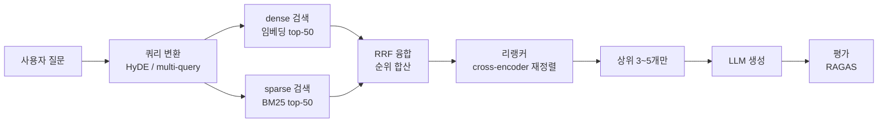

## 0. "청킹→임베딩→top-k"가 자주 틀리는 이유

RAG(Retrieval-Augmented Generation, 검색으로 찾은 문서 조각을 LLM 프롬프트에 넣어 답하게 하는 방식)를 처음 만들 때 거의 다 같은 코드를 쓴다. 문서를 일정 토큰 길이로 자르고(청킹), 각 조각을 임베딩(벡터)으로 바꿔 벡터DB에 넣고, 질문이 오면 질문 벡터와 가까운 조각 top-k를 꺼내 프롬프트에 붙인다. 데모는 잘 돈다. 그런데 실제 문서에 붙이면 틀린 답이 자주 나온다.

세 군데서 샌다. 첫째, 청크 경계가 나쁘면 답이 두 조각으로 갈라진다. 표 한가운데를 자르거나, "그것"이 가리키는 대상이 앞 조각에 있으면, 꺼낸 조각만으로는 답이 안 나온다. 둘째, 의미 검색에는 사각이 있다. 벡터는 "비슷한 뜻"은 잘 찾지만 제품 코드 `RK3588`, 사람 이름, 정확한 법조문 번호 같은 정확 일치(exact match)에는 약하다. 셋째, top-k가 관련성 순서를 보장하지 않는다. 임베딩이 가깝다고 정답인 게 아니라서, 진짜 답이 7번째에 있고 1~5번째가 노이즈면 LLM은 노이즈를 읽고 헛소리를 한다.

> **기본 RAG의 실패는 모델이 멍청해서가 아니라 검색이 틀린 조각을 줘서다. 검색 품질을 끌어올리는 일이 RAG 심화의 전부다.**

이 글은 검색 품질을 올리는 다섯 단계 기법을 실제 제품·수치와 함께 정리한다. 청킹, 임베딩·벡터DB, 하이브리드 검색, 리랭킹, 쿼리 변환, 그리고 이게 실제로 나아졌는지 재는 평가까지다. 여러 사실을 이어야 답이 나오는 multi-hop 질문 자체를 구조로 푸는 [GraphRAG](/ax/kr-02-graphrag/), 세션을 넘겨 무엇을 기억할지 다루는 [에이전트 메모리](/building-with-ai/agent-04-memory/)는 별도 글로 다뤘다. 여기서는 일반 RAG의 검색 파이프라인 자체를 끌어올리는 데 집중한다.



*그림. 심화 RAG 파이프라인. 질문을 변환해 dense·sparse 두 갈래로 넓게 검색하고, RRF로 합친 뒤 리랭커가 좁힌다. 마지막에 RAGAS로 검색·생성 품질을 측정한다.*

## 1. 청킹 — 답이 한 조각에 온전히 담기게

청킹은 RAG에서 가장 과소평가되는 단계다. 검색이 아무리 좋아도 조각이 잘못 잘렸으면 답을 못 찾는다. 전략은 크게 네 가지다.

**고정 크기(fixed-size)**는 N토큰마다 기계적으로 자른다. 가장 단순하지만 문장·표·코드 한가운데를 끊는다. 토큰 길이만 정하면 되니 구현은 5분이지만 품질이 가장 낮다.

**재귀(recursive)**는 구분자에 우선순위를 둔다. 문단 경계 → 줄바꿈 → 문장 끝 → 공백 → 글자 순으로 시도하면서, 문서 자체의 구조를 최대한 존중해 자른다. LangChain의 `RecursiveCharacterTextSplitter`가 이 방식이고, 2026년 벤치마크에서 종단 정확도(end-to-end accuracy) 69%로 여러 전략 중 가장 높았다. 대부분의 경우 기본값으로 이걸 쓰면 된다.

**의미(semantic)**는 인접 문장의 임베딩 유사도를 보고, 주제가 바뀌는 지점에서 자른다. 주제가 순수한 조각이 나와 검색 재현율(recall)은 91.9%로 가장 높지만, 종단 정확도는 54%로 오히려 재귀보다 낮았다. 조각이 너무 깔끔하게 잘려 LLM이 답을 쓸 때 필요한 주변 맥락이 모자라는 역설이다.

**부모-자식(parent-child)·late chunking**은 정밀과 맥락을 분리한다. 검색은 작은 자식 조각으로 정밀하게 하되, LLM에 넘길 때는 그 조각이 속한 큰 부모 조각을 통째로 준다. late chunking은 한발 더 나아가 문서 전체를 먼저 임베딩한 뒤 잘라서, 각 조각이 앞뒤 맥락(헤더, 대명사, 상호참조)을 임베딩 안에 머금게 한다. "그것", "위 표"처럼 주변 없이는 모호한 조각이 많은 문서에서 쓴다.

| 전략 | 자르는 기준 | 강점 | 한계 | 대표 도구 |
|---|---|---|---|---|
| 고정 크기 | N토큰마다 | 구현 즉시 | 문장·표 한가운데 끊김 | 직접 슬라이싱 |
| 재귀 | 구분자 우선순위 | 종단 정확도 최고(69%), 기본값 | 의미 경계는 못 봄 | RecursiveCharacterTextSplitter |
| 의미 | 임베딩 유사도 변화 | 재현율 최고(91.9%) | 맥락 부족, 종단 정확도 낮음(54%) | SemanticChunker |
| 부모-자식 / late | 자식 검색·부모 전달 | 정밀+맥락 동시 | 색인 복잡·비용↑ | ParentDocumentRetriever |

청크 크기는 512토큰이 대부분의 RAG에서 좋은 출발점이다. 오버랩(인접 조각 간 겹치는 부분)은 관습적으로 10~20%를 넣는데, 2026년 1월 한 연구는 SPLADE 같은 sparse 검색에서는 오버랩이 측정 가능한 이득을 주지 않는다고 보고했다. 즉 오버랩은 공짜가 아니라 색인 크기를 늘리는 비용이니, 검색 방식에 따라 효과를 재 보고 정해야 한다.

## 2. 임베딩과 벡터DB — 무엇으로 재고 어디에 담나

조각을 벡터로 바꾸는 임베딩 모델부터. 2026년 MTEB(임베딩 성능 벤치마크) 상위권은 Cohere embed-v4(65.2), OpenAI text-embedding-3-large(64.6), BGE-M3(63.0) 순이다. 셋의 성격이 다르다.

- **OpenAI text-embedding-3-large**: 3,072차원. Matryoshka 표현학습을 써서 `dimensions` 파라미터로 512·256차원처럼 짧게 잘라 받을 수 있다. 차원을 줄이면 저장·검색 비용이 내려가고 품질은 조금만 떨어진다.
- **BGE-M3**: BAAI의 오픈 가중치 다국어 모델. 100개 넘는 언어, 8k 컨텍스트를 받고, 하나의 모델이 dense·sparse·multi-vector 세 가지 검색 표현을 동시에 낸다. 자체 호스팅하는 오픈소스 표준이다.
- **Cohere embed-v4**: 100개 넘는 언어 지원에 더해, 색인용 `search_document`와 질의용 `search_query` 입력 타입을 따로 둬서 같은 텍스트라도 용도에 맞게 다르게 임베딩한다.

벡터를 담는 벡터DB는 인덱스 알고리즘이 핵심이다. 대표가 HNSW(Hierarchical Navigable Small World, 그래프 기반 근사 최근접 탐색)와 IVF(역색인 군집화)다. HNSW는 온라인 질의 지연이 낮고 데이터를 하나씩 끼워 넣어도 인덱스를 다시 안 지어도 된다. 대신 색인을 짓는 게 느리고 메모리를 많이 먹는다. 100만 벡터에서 HNSW 인덱스가 IVFFlat의 약 3~4배 메모리를 썼다. IVF는 군집 기반이라 메모리는 적게 쓰지만, 데이터가 늘면 주기적으로 다시 군집화해야 한다.

| 제품 | 형태 | 인덱스 | 하이브리드 검색 | 메모 |
|---|---|---|---|---|
| pgvector | Postgres 확장 | HNSW(0.5.0+), IVFFlat | 직접 BM25 결합 필요 | 1M 규모서 전용DB와 동급, 5K~15K QPS(1024차원) |
| Qdrant | 자체호스팅/클라우드 | HNSW | v1.9+ named vector hybrid | 필터링 속도 최상급, Rust |
| Weaviate | 자체호스팅/클라우드 | HNSW | BlockMax WAND + RSF 내장 | 키워드+벡터 한 쿼리 |
| Milvus | 분산 | HNSW·IVF 등 다수 | 2.5+ Sparse-BM25 | 10억 벡터급 샤딩 성숙 |
| Pinecone | 관리형 SaaS | 독자 | 독자 sparse 인코딩 | 운영 부담 최소, 폐쇄형 |

"Postgres는 벡터에 느리다"는 말은 IVFFlat 시절 이야기다. pgvector 0.5.0 이후 HNSW가 들어오면서 100만 규모에서는 99% 정확도 기준으로 전용 벡터DB와 맞먹거나 앞선다. 이미 Postgres를 쓰는 시스템이면 벡터DB를 따로 세우기 전에 pgvector부터 재 보는 게 합리적이다. 10억 벡터급으로 가야 Milvus의 샤딩이 필요해진다.

## 3. 하이브리드 검색 — dense의 사각을 sparse로 메운다

dense 검색(임베딩 벡터의 거리)과 sparse 검색(BM25 같은 단어 빈도 기반)은 사각지대가 정확히 어긋난다. BM25는 제품 코드·고유명사·정확한 기술 용어 같은 정확 일치에 강하지만 의미는 모른다. dense는 개념·바꿔쓴 표현(paraphrase)에 강하지만 드물게 등장하는 정확 용어를 과소평가한다. 그래서 둘을 같이 돌려 합치는 게 하이브리드 검색이다.

문제는 두 점수를 못 더한다는 것이다. BM25 점수는 0~수십의 비정규화 값이고 코사인 유사도는 0~1이라 척도가 다르다. 여기서 RRF(Reciprocal Rank Fusion, 역순위 융합)가 표준 해법이다. 점수 대신 순위만 쓴다. 각 검색기에서 문서가 받은 RRF 점수는 `1/(k + rank)`이고 `k`는 보통 60이다. 두 검색기의 순위 점수를 더해 다시 정렬한다. 척도가 다른 점수를 섞는 문제를 피하면서 두 검색의 장점을 합친다.

이 코드를 보이는 목적은, 하이브리드+RRF가 별 게 아니라 "두 검색 결과의 순위를 합산하는 짧은 함수"임을 보이기 위해서다.

```python
# retrieval/fusion.py — dense·sparse 결과를 RRF로 합치는 함수
def reciprocal_rank_fusion(dense_ids, sparse_ids, k=60, top_n=10):
    # 각 문서 id -> 합산 점수. dense·sparse 두 순위를 모두 반영한다
    scores = {}
    for ranked in (dense_ids, sparse_ids):          # 두 검색 결과를 차례로
        for rank, doc_id in enumerate(ranked):      # 순위는 0부터 (1등=0)
            # 핵심: 점수가 아니라 순위(rank)만 쓴다. 상위일수록 1/(k+rank)이 커짐
            scores[doc_id] = scores.get(doc_id, 0.0) + 1.0 / (k + rank)
    # 합산 점수 높은 순으로 정렬해 상위 top_n만 반환
    return sorted(scores, key=scores.get, reverse=True)[:top_n]
```

효과는 측정으로 확인된다. WANDS 이커머스 벤치마크에서 튜닝한 하이브리드는 NDCG 0.7497로, BM25 단독(0.6983)·벡터 단독(0.6953) 어느 쪽보다 7.4% 높았다. 2026년 기준 Weaviate(BlockMax WAND), Milvus 2.5+(Sparse-BM25), Qdrant v1.9+가 하이브리드를 네이티브로 지원해, 직접 RRF를 구현하지 않아도 한 쿼리로 받을 수 있다. dense·sparse 후보는 리랭킹 예산에 따라 보통 각 top-50에서 top-500까지 넓게 뽑는다.

## 4. 리랭킹 — 넓게 뽑아 정밀하게 좁힌다

하이브리드로 top-50을 뽑아도, 그 50개의 순서는 여전히 거칠다. 임베딩은 질문과 문서를 따로 벡터로 만들어 거리만 재는 bi-encoder라서, 둘의 미세한 관계를 못 본다. 리랭커는 cross-encoder다. 질문과 문서를 한 쌍으로 같이 모델에 넣어 관련성을 직접 채점한다. 정확도는 훨씬 높지만 쌍마다 모델을 돌려야 해서 느리다. 그래서 검색으로 50개를 싸게 뽑고, 리랭커로 그 50개만 다시 채점해 상위 3~5개로 좁히는 2단계 구조를 쓴다.

대표 제품은 Cohere Rerank 3.5(API)와 BGE-reranker-v2-m3(오픈 가중치)다. 한 벤치마크에서 BGE-reranker-v2-m3는 238ms, Cohere Rerank 3.5는 392ms 지연을 보였는데, 같은 하드웨어에서 BGE-M3 기반 리랭커가 Cohere의 약 10배 지연(400ms 대 40ms)을 낸 비교도 있다. 수치는 하드웨어·배치 크기·후보 수에 크게 흔들리니 절대값보다 "리랭킹은 후보 수에 비례해 무거워진다"는 성질로 받아들이는 게 맞다. 후보를 50개에서 200개로 늘리면 그만큼 느려진다. 리랭킹 평가는 Precision@K·Recall@K·MRR@K(K=1,3,5)로 한다.

리랭킹은 검색 품질에서 투자 대비 효과가 가장 확실한 단계다. 청킹·임베딩을 바꾸려면 색인을 다시 지어야 하지만, 리랭커는 검색 뒤에 한 단계 끼우기만 하면 된다. 기존 RAG가 "관련 조각이 분명 있는데 자꾸 엉뚱한 걸 위에 올린다"면 가장 먼저 넣어 볼 게 리랭커다.

## 5. 쿼리 변환 — 질문을 검색이 잘 받는 형태로

검색을 못 하는 원인이 문서가 아니라 질문일 때가 있다. 사용자의 짧은 질문과 문서의 서술체 문장은 임베딩 공간에서 거리가 멀다. 질문을 검색에 맞게 손보는 게 쿼리 변환이다.

- **HyDE(Hypothetical Document Embeddings, 가상 문서 임베딩)**: 질문을 바로 임베딩하지 않고, LLM에게 "이 질문에 답하는 문서가 있다면 뭐라고 쓰여 있을까"를 먼저 쓰게 한다. 그 가상 답변을 임베딩해 검색한다. 질문이 아니라 답변끼리 비교하니 문서와 거리가 가까워져 재현율이 오른다. 가상 답변이 사실일 필요는 없다. 형태만 문서를 닮으면 된다.
- **multi-query**: 한 질문을 LLM으로 비슷한 여러 질문으로 늘려 각각 검색하고 결과를 합친다. 한 가지 표현으로는 놓치는 조각을 표현을 바꿔 잡는다.
- **query decomposition(질의 분해)**: 복합 질문을 하위 질문으로 쪼개 따로 검색한다. "A의 매출과 B의 매출 차이는?"을 A 매출, B 매출 두 검색으로 나누는 식이다.

셋 다 LLM 호출이 한두 번 더 붙어 지연과 비용이 늘고, HyDE는 LLM이 가상 답변을 엉뚱하게 쓰면 검색을 더 흐릴 수 있다. 그래서 모든 질문에 거는 게 아니라, 검색이 잘 안 되는 질문 유형에만 선택적으로 붙이는 게 보통이다.

## 6. 평가 — 나아졌는지 어떻게 아는가

여기까지 기법을 다 넣어도 "정말 좋아졌나"를 모르면 의미가 없다. 눈으로 몇 개 보고 "좋아진 것 같다"는 착각이다. RAG 평가는 2026년 기준 정착된 분야이고, 사실상 표준이 RAGAS다. LLM을 심판으로 써서(LLM-as-judge) 네 지표를 잰다.

- **faithfulness(충실성)**: 답이 검색된 맥락에 사실로 근거하는가. 환각을 잡는다.
- **answer relevancy(답변 관련성)**: 답이 질문에 맞는가.
- **context precision(맥락 정밀도)**: 검색된 맥락이 질문과 관련 있는가. 검색기 품질 지표다.
- **context recall(맥락 재현율)**: 답에 필요한 정보를 검색이 다 가져왔는가.

앞 두 개는 생성 품질, 뒤 두 개는 검색 품질이다. 청킹·하이브리드·리랭킹을 바꿨을 때 context precision·recall이 오르는지 보면 검색 개선이 실제였는지 갈린다. faithfulness가 낮으면 모델이 맥락을 벗어나 지어내고 있다는 뜻이다. RAGAS는 이 넷 외에 noise sensitivity, context entities recall 등도 제공한다.

평가에서 사람이 빠질 수 없는 게 데이터셋이다. 어떤 질문에 어떤 답·근거가 맞는지(ground truth)는 사람이 정해 줘야 LLM 심판이 채점할 기준이 생긴다. 이 정답 셋의 품질이 평가 전체의 품질을 결정한다.

## 7. 사람에게 남는 일

청킹도, 임베딩 변환도, RRF 융합도, 리랭킹 호출도, RAGAS 채점도 도구가 자동으로 한다. Claude Code에게 "재귀 청킹 512토큰으로 자르고, pgvector에 HNSW로 색인하고, BM25와 RRF로 합친 뒤 Cohere Rerank로 상위 5개를 골라 답하게 하라"고 지시하면 그 파이프라인을 짜 준다. 그럴수록 사람의 일은 파이프라인 구현에서 그 위의 판단으로 옮겨간다.

판단해야 할 게 셋이다. 첫째, 무엇을 한 조각으로 둘지. 이 문서에서 답이 온전히 담기는 단위가 문단인가 절인가 표 하나인가는 문서를 아는 사람이 정한다. 둘째, 무엇을 진실의 출처로 둘지. 같은 사실이 여러 문서에 충돌하게 적혀 있을 때 어느 쪽을 믿을지는 검색기가 못 정한다. 셋째, 검색이 맞았는지 재는 기준. 어떤 질문에 어떤 근거가 정답인지를 사람이 ground truth로 박아 줘야 RAGAS가 채점한다.

도구는 주어진 청크 경계와 정답 셋에 맞춰 파이프라인을 최적화하지만, 청크 경계를 어디에 그을지와 무엇이 정답인지는 묻지 않으면 정해 주지 않는다. 검색 품질을 끌어올리는 기법이 다 자동화된 시대에 사람에게 남는 일은, 무엇을 청크 경계와 진실의 출처로 둘지 정의하는 능력과 검색이 실제로 맞았는지 잴 기준을 세우는 능력이다.

---

## 출처

- Denser.ai, "RAG Chunking Strategies 2026: 8 Methods Compared with Code Examples", https://denser.ai/blog/rag-chunking-strategies/
- DigitalApplied, "RAG Chunking Strategies: A 2026 Retrieval Playbook", https://www.digitalapplied.com/blog/rag-chunking-strategies-2026-retrieval-quality-playbook
- DigitalApplied, "Hybrid Search: BM25, Vector & Reranking 2026", https://www.digitalapplied.com/blog/hybrid-search-bm25-vector-reranking-reference-2026
- Denser.ai, "Hybrid Search for RAG: Combining BM25 and Dense Vector Search (2026 Guide)", https://denser.ai/blog/hybrid-search-for-rag/
- Agentset, "Cohere Rerank 3.5 vs BAAI/BGE Reranker v2 M3", https://agentset.ai/rerankers/compare/cohere-rerank-35-vs-baaibge-reranker-v2-m3
- Local AI Master, "Reranking & Cross-Encoders for RAG: BGE, Cohere, Jina (2026)", https://localaimaster.com/blog/reranking-cross-encoders-guide
- Haystack, "Using Hypothetical Document Embeddings (HyDE) to Improve Retrieval", https://haystack.deepset.ai/cookbook/using_hyde_for_improved_retrieval
- CallSphere, "Vector Database Benchmarks 2026: pgvector 0.9, Qdrant, Weaviate, Milvus, LanceDB", https://callsphere.ai/blog/vector-database-benchmarks-2026-pgvector-qdrant-weaviate-milvus-lancedb
- Vecstore, "pgvector vs Pinecone vs Qdrant: 2026 Benchmarks", https://vecstore.app/blog/vector-database-performance-compared
- MyEngineeringPath, "Embeddings Comparison — OpenAI vs Cohere vs Open-Source Models (2026)", https://myengineeringpath.dev/tools/embeddings-comparison/
- FutureAGI, "What is RAG Evaluation? Frameworks, Metrics, and Gates in 2026", https://futureagi.com/blog/what-is-rag-evaluation-2026/
- Ragas, "List of available metrics", https://docs.ragas.io/en/stable/concepts/metrics/available_metrics/

*※ 청킹 정확도(재귀 69% / 의미 54% / 의미 재현율 91.9%), 하이브리드 NDCG 수치, 리랭커 지연(238/392ms, 40 대 400ms)은 위 출처가 제시한 벤치마크값이며 데이터셋·하드웨어에 따라 달라진다. 리랭커 지연은 후보 수·배치에 특히 민감하다.*
