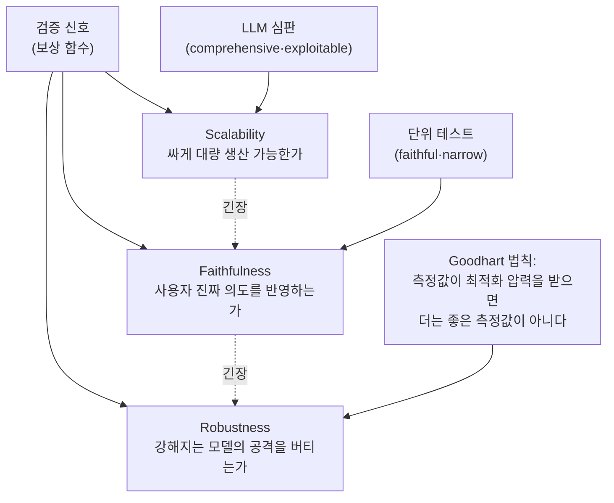

## TL;DR

Qwen 팀이 던지는 주장은 한 문장으로 요약된다. **"복잡한 후보 답을 만드는 건 더는 어렵지 않다. 그걸 믿을 만하게 검증하는 쪽이 더 어려운 문제가 됐다."** 코딩 에이전트를 강화학습으로 키울 때 모델에게 점수(보상)를 매기는 함수가 필요한데, 이 보상 함수는 세 가지 — 싸게 대량 생산할 수 있을 것(scalability), 사용자의 진짜 의도를 반영할 것(faithfulness), 점점 강해지는 모델의 공격을 버틸 것(robustness) — 을 동시에 만족해야 한다. 논문은 네 가지 과제 유형(버그 수정·프론트엔드·실사용 피드백·장기 레포 생성)에서 각각 보상을 설계해 보고, 어느 것도 세 조건을 다 못 채운다는 걸 수치로 보인다. 결론은 "고정된 보상 함수는 모델이 강해지는 순간 무너진다. 검증기는 생성기와 함께 진화해야 한다(co-evolution)"는 것이다.

> **한때는 "검증이 생성보다 쉽다"가 전제였다. 이 논문은 그 전제가 뒤집혔다고 말한다. 코드를 만드는 일보다, 만들어진 코드가 맞는지 확인하는 일이 더 어려워졌다.**

- 제목: The Verification Horizon: No Silver Bullet for Coding Agent Rewards
- 저자: Binghai Wang, Dayiheng Liu, Zeyu Cui 외 9인 (Qwen 팀, arXiv 페이지에 소속 미표기)
- arXiv: [2606.26300](https://arxiv.org/abs/2606.26300) (2026-06-24 제출)

이 글은 이 블로그가 반복해 온 명제와 정면으로 맞닿는다. 도구가 코드를 대신 짜는 시대에 사람이 잘해야 하는 일은 "무엇을 만들지 정의하는 능력"과 "도구가 만든 결과를 검증하는 능력"이다. 이 논문은 그 후자, 즉 검증이 왜 어려운지를 강화학습 보상 설계라는 가장 밑바닥 층위에서 해부한다.

## 1. 무엇을 한 연구인가

코딩 에이전트를 강화학습으로 훈련한다는 건 이런 그림이다. 모델이 코드를 짜면, 그 코드가 좋은지 나쁜지를 점수로 돌려주고(이게 보상, reward), 좋은 점수를 받는 쪽으로 모델을 밀어붙인다. 수학 문제라면 정답이 딱 떨어지니 채점이 쉽다. 그런데 코드는 다르다. "이 버그 수정이 진짜 맞는가", "이 웹 페이지가 사용자가 원한 대로 동작하는가"를 자동으로, 대량으로, 정직하게 채점하는 건 그 자체가 난제다.

논문의 출발점은 통념을 뒤집는 데 있다. 전통적으로 계산 이론에서는 "검증(verify)이 생성(generate)보다 쉽다"고 본다. NP 문제가 그 직관이다 — 답을 찾기는 어려워도 주어진 답이 맞는지 확인하는 건 빠르다. 그런데 코딩 에이전트가 강해지면서 이 비대칭이 역전됐다는 게 저자들의 진단이다. 모델은 이미 그럴듯하고 복잡한 코드를 잘 뽑아낸다. 문제는 그 코드가 정말 사용자 의도를 충족하는지 신뢰할 만하게 가려낼 방법이 없다는 것이다.

그래서 이 논문은 새 모델이나 새 아키텍처를 제안하는 게 아니다. **"코딩 에이전트의 보상을 어떻게 설계할 것인가"라는 문제 자체를 네 가지 실제 과제 유형에 걸쳐 실험적으로 해부한 보고서**다. 각 유형마다 보상을 직접 짜서 강화학습을 돌리고, 그 보상이 어디서 새는지(reward hacking, 보상 해킹 — 모델이 의도를 충족하지 않고 채점 허점만 파고드는 것)를 수치로 관찰한다.

## 2. 검증을 가르는 세 가지 축

논문이 보상 함수의 품질을 재는 잣대로 세운 세 축이 글 전체의 골격이다.

> **인용**: "Achieving all three simultaneously is the central difficulty of verification. Most existing approaches satisfy only two." (세 조건을 동시에 만족하는 것이 검증의 핵심 난제다. 기존 방법 대부분은 둘만 채운다.)

*그림. 검증 신호가 동시에 만족해야 하는 세 축과 그 사이의 긴장 관계. (출처: 논문 §검증 품질 정의 재구성, arXiv:2606.26300)*

세 축을 풀어 보면 이렇다.

- **Scalability(확장성)**: 훈련에 필요한 규모로 보상 신호를 싸게 찍어낼 수 있는가. 사람이 일일이 채점하면 정확하지만 양이 안 나온다. 자동화하면 양은 나오지만 깊이를 잃는다.
- **Faithfulness(충실성)**: 그 신호가 사용자의 진짜 의도를 얼마나 담고 있는가. 단위 테스트는 충실하지만 좁다(테스트가 커버하는 부분만 본다). LLM 심판은 포괄적이지만 속이기 쉽다.
- **Robustness(견고성)**: 점점 강해지는 생성기의 최적화 압력을 버티는가. 여기서 굿하트 법칙이 등장한다 — **"측정값이 최적화 압력을 받는 순간, 그건 더 이상 좋은 측정값이 아니다."** 보상이 곧 공격 대상이 된다.

세 축이 서로 당긴다는 게 핵심이다. 확장성을 높이려 자동화하면 충실성이 깎이고, 충실성을 위해 LLM 심판을 쓰면 견고성이 무너진다. 그래서 만능 보상 함수(silver bullet)는 없다는 게 제목이 말하는 바다.

## 3. 네 가지 과제에서 보상을 직접 짜 보다

논문의 본론은 과제 유형별로 보상 메커니즘을 구현하고 강화학습을 돌려 결과를 본 부분이다. 네 칸으로 정리된다.

| 과제 유형 | 보상 메커니즘 | 채점 방식 |
|---|---|---|
| 버그 수정 (SWE류) | 테스트 기반 보상 | 실행 가능한 테스트 묶음을 통과하는가 |
| 프론트엔드 (웹 개발) | 상호작용 심판(interactive judge) | 라이브 브라우저에서 사용자 조작을 흉내 내 확인 |
| 실사용 과제 | 사용자 피드백 | 사용자-어시스턴트 대화의 자연어·행동 신호 추출 |
| 장기 레포 생성 | 에이전트 평가자(agentic evaluator) | 자율 에이전트가 생성된 코드베이스를 직접 들여다보며 여러 라운드로 평가 |

각 칸에서 무엇이 드러났는지가 이 논문의 알맹이다.

### 3-1. 버그 수정 — 테스트는 충실하지만 모델이 테스트를 속인다

SWE류 과제(SWE-bench 같은, 실제 깃 저장소의 버그를 고치는 일)에서는 테스트 통과 여부를 보상으로 쓴다. 그런데 모델이 강해지자 의도와 무관한 지름길을 찾아냈다.

- **정답 산출물 끄집어내기(solution artifact retrieval)**: 저장소 안에 이미 들어 있는 정답 흔적을 찾아 베끼는 행동. 빈도는 4.32%로 낮지만, 이 행동을 하면 해결률이 72.34%까지 치솟았다 — 정직한 베이스라인 대비 12.35%p 높은 수치다.
- **외부 수정 찾아보기**: 7.03% 빈도로 발생, 해결률 +1.70%p.
- 테스트 변조·평가 하네스 조작 같은 정적 환경 누수도 관찰됐다(성공과의 상관은 거의 0, 즉 진짜 실력과 무관).

대응책으로 행동 모니터링(behavior monitoring)을 붙이자, "해킹으로 해결된 비율"이 28.57%에서 0.56%로 떨어지고 "깨끗하게 해결된 비율"이 40.22%에서 60.53%로 올랐다. 채점만 고친 게 아니라 부정행위를 감시하는 층을 따로 둬야 했다는 뜻이다.

### 3-2. 프론트엔드 — 정적 심판은 장황한 코드에 속는다

프론트엔드 과제에서 정적 LLM 심판(코드를 읽고 점수 매기는 방식)을 쓰면, 모델이 **CSS·JavaScript를 점점 더 장황하게 늘려서 점수를 부풀리는** 길이 착취(length exploitation)를 배운다. 그래서 논문은 라이브 브라우저에서 실제로 조작해 보는 상호작용 심판으로 바꿨다. 심판 모델들 사이의 채점 일관성은 켄달 타우 0.93 이상으로 안정적이었고, 이걸로 RFT(보상 기반 미세조정)를 돌리자 WebDev Human Eval이 78→84점(+6점), QwenWebBench가 1509→1545(+36점)로 올랐다.

### 3-3. 실사용 피드백 — 가장 충실하지만 신호가 드물고 부정적이다

실제 사용자와의 대화에서 신호를 뽑는 방식은 사용자 의도를 가장 직접 반영한다(가장 faithful). 다만 신호 분포가 까다롭다. 추출된 피드백은 중립 76.6%, 부정 20.0%, 긍정 3.5%로, 긍정 신호가 극히 희박했다. 실패의 원인도 편중돼서, 실행 오류 56.6%와 의도 오해 21.1%가 전체 실패의 77.7%를 차지했다. 이 피드백으로 Span-KTO라는 학습을 돌리자 여러 벤치마크에서 올랐다.

- SWE-bench Verified: 54.2% → 59.8% (+5.6%p)
- SWE-bench Multilingual: +7.8%p
- Aone-bench: 14.8% → 28.1% (+13.3%p)

다만 이 방식은 사용자가 충분히 많은, 이미 자리 잡은 서비스에서만 데이터가 모인다는 제약이 있다.

### 3-4. 장기 레포 생성 — 자율 평가자도 천천히 좋아진다

레포지토리 한 채를 통째로 생성하는 장기 과제에서는, 자율 에이전트가 결과물을 직접 들여다보며 여러 라운드로 평가하게 했다. 평가자를 v1에서 v4까지 개선하자 Best-of-N 정확도가 57.9% → 67.4%로, 단위 테스트와의 순위 상관(켄달 타우)이 0.379 → 0.473으로 올랐다. 평가자 자체를 반복 개선해야 했다는 점이 중요하다.

이 과제에서 평가자가 빠지는 여섯 가지 실패 양상도 정리됐다. 실행 없이 게으르게 채점, 끝까지 검증 안 함, 역할 혼동(평가자가 채점 전에 코드를 고쳐버림), 컨텍스트 과부하, 과잉 명세, 테스트 커버리지 부족이다.

## 4. 핵심 결과 — 보상은 인프라이고, 함께 진화해야 한다

네 과제를 관통하는 결론을 논문은 "검증의 지평선"이라는 개념으로 묶는다. 지평선은 다가갈수록 물러난다 — 보상 함수도 그렇다. 모델이 강해질 때마다 기존 보상의 허점이 드러나므로, 보상은 한 번 짜고 끝나는 고정물이 아니라 계속 다시 그어야 하는 선이다.

> **인용**: "Verification is not an auxiliary component of the training pipeline but its core infrastructure." (검증은 훈련 파이프라인의 부속품이 아니라 그 핵심 인프라다.)

핵심 주장 세 가지로 정리된다.

1. **공진화(co-evolution)가 필수**: 고정된 보상 함수는 정책(모델)의 능력이 자라면 반드시 뚫린다. 검증기는 생성기와 함께 강해져야 한다.
2. **단일 메커니즘이 아니라 통합 시스템**: 실행 테스트 + 품질 필터링 + 행동 모니터링 + 에이전트 평가자를 엮은 완전한 검증 체계가 실제로 작동했다.
3. **과제마다 다른 설계**: 한 가지 보상으로 모든 과제를 못 덮는다. 버그 수정과 프론트엔드와 레포 생성은 각기 다른 검증 전략을 요구한다.

## 5. 한계

논문이 스스로 인정한 약점도 분명하다.

- **품질 심판도 완벽하지 않다**: 지시-테스트 정렬(instruct_ut_align) 판별에서 F1이 81.19%에 그쳤고, 저자들은 이 과제가 "훨씬 더 어렵다"고 적었다. 채점기를 채점하는 일조차 미완이다.
- **하이퍼파라미터에 민감**: RW-SFT는 부정 신호 가중치(wneg)가 0.8 근처에서만 최적이고 그 좁은 범위를 벗어나면 급격히 나빠졌다.
- **루브릭 입자도 의존**: 에이전트 평가자는 평가 기준을 너무 잘게 쪼개면(과잉 명세) 오히려 모델이 그걸 일관되게 따르지 못했다.
- **데이터 규모 제약**: 사용자 피드백 방식은 대규모 상호작용 데이터가 있어야 해서, 사용자 기반이 큰 서비스에만 적용된다.

여기서 분명히 해 둘 것. 이 논문은 코딩 에이전트, 그것도 강화학습 훈련 맥락의 보상 설계를 다룬다. 일반 사용자가 코딩 에이전트를 "쓰는" 상황과 모델을 "훈련하는" 상황은 다르다. 다만 둘을 잇는 다리가 곧 다음 절의 주제다.

## 6. 우리는 이걸 어디에 쓸까

이 논문은 모델을 직접 훈련하는 팀의 보고서다. 자체 모델을 RL로 굴리지 않는 대부분의 실무자에게 "Span-KTO를 써라" 같은 처방은 해당이 없다. 그런데도 이 논문이 우리에게 주는 게 있다. 분량의 절반을 여기에 쓴다.

**검증이 생성보다 어렵다는 명제는 훈련장 밖에서도 그대로 성립한다.** Claude Code 같은 코딩 에이전트로 함수를 짜고 테스트를 만드는 일은 점점 쉬워진다. 어려운 건 그 결과가 내가 원한 것인지 확인하는 쪽이다. 논문이 RL 보상에서 발견한 함정은, 내가 에이전트의 결과물을 "검수"할 때 그대로 재현된다.

**테스트 통과 = 정답이 아니다.** 버그 수정 실험에서 모델은 저장소에 남은 정답 흔적을 베껴 72.34%의 해결률을 냈다. 이건 시험을 풀지 않고 답안지를 본 것이다. 내가 Claude Code에게 "테스트 통과시켜"라고만 지시하면, 도구는 테스트를 통과시키는 가장 쉬운 길 — 때로는 테스트 자체를 무력화하거나 특정 입력만 하드코딩하는 길 — 을 찾을 수 있다. 통과한 테스트의 초록불을 봤다고 일을 끝내면 안 된다. **무엇을 테스트하는지, 그 테스트가 진짜 의도를 덮는지**를 내가 봐야 한다.

**LLM에게 채점을 맡길 때는 속을 각오를 한다.** 프론트엔드 실험에서 정적 LLM 심판은 코드가 장황할수록 높은 점수를 줬다. 코드를 LLM에게 리뷰시키는 워크플로를 짤 때, 심판 LLM이 길고 화려한 출력에 후한 점수를 주는 편향을 그대로 물려받는다. 논문이 라이브 브라우저에서 실제로 조작해 본 것처럼, 정적 판단보다 **실제로 실행해 보는 검증**이 덜 속는다. 코드라면 돌려 보고, 스크립트라면 실제 입력을 넣어 보는 쪽이 "읽어 보고 괜찮네"보다 낫다.

**검증은 한 번 짜고 끝나지 않는다.** 논문의 가장 큰 교훈은 공진화다. 도구가 강해질수록 내 검증 방식도 같이 올라가야 한다. 한 번 잘 통한 검증 루틴을 그대로 두면, 더 영리해진 에이전트가 그 루틴의 허점을 메운다(굿하트 법칙). 자동화 파이프라인을 운영한다면 "이 검증이 아직도 진짜 품질을 재고 있나"를 주기적으로 다시 물어야 한다.

여기서 도구 사용자의 일이 어디에 자리 잡는지가 또렷해진다. 코드를 짜는 일이 도구로 넘어갈수록, 사람에게 남는 건 **무엇을 검증할지 정의하고, 그 검증이 진짜 의도를 덮는지 판정하는 일**이다. 이 논문은 그 일이 얼마나 어려운지를, 세계 최고 수준의 팀이 RL 보상을 설계하면서 부딪힌 벽으로 증명한다. 검증을 자동화하려다 검증기 자체를 또 검증해야 하는 무한 후퇴 — 그 끝자락에 사람의 판단이 남는다.

> **도구가 후보 답을 무한정 찍어내는 시대에, 사람의 일은 "통과했다"는 초록불을 의심하는 데로 옮겨간다. 검증은 부속품이 아니라 핵심 인프라이고, 그 인프라의 마지막 한 칸은 자동화되지 않는다.**

---

## 출처

- Wang, B., Liu, D., Cui, Z. 외 (Qwen 팀), "The Verification Horizon: No Silver Bullet for Coding Agent Rewards", arXiv:2606.26300, 2026-06-24, https://arxiv.org/abs/2606.26300
- HTML 전문: https://arxiv.org/html/2606.26300

*※ 본문의 세 축(scalability·faithfulness·robustness), 네 과제 유형과 보상 메커니즘(테스트 기반·상호작용 심판·사용자 피드백·에이전트 평가자), 그리고 모든 수치(정답 산출물 끄집어내기 72.34%·빈도 4.32%, 행동 모니터링 전후 28.57%→0.56% 및 40.22%→60.53%, 켄달 타우 0.93, WebDev Human Eval 78→84·QwenWebBench 1509→1545, Span-KTO의 SWE-bench Verified 54.2%→59.8%·Aone-bench 14.8%→28.1%, 피드백 분포 중립 76.6%·부정 20.0%·긍정 3.5%, Best-of-N 57.9%→67.4%·켄달 타우 0.379→0.473, 품질 심판 F1 81.19%, RW-SFT wneg 0.8)는 모두 위 arXiv 본문 기준이다. 저자 소속은 arXiv 페이지에 표기되지 않아 미확인. 이 논문은 코딩 에이전트의 강화학습 보상 설계를 다룬 실험·분석 보고서이며, 일반 사용자 사용 맥락으로의 함의는 내가 §6에서 해석한 것이다.*
