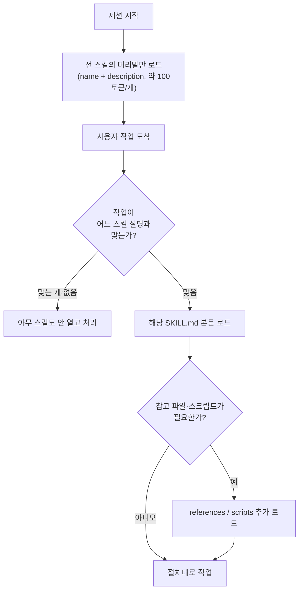

## 0. "요새 스킬 좋은 게 많이 나왔다"는 말의 실체

스킬이 많이 나왔다는 말을 여러 번 들었다. 그래서 직접 확인해 봤다. 결론부터 말하면 그 말은 절반만 맞다. 숫자는 폭발적으로 늘었다. 한 커뮤니티 큐레이션 저장소(VoltAgent/awesome-agent-skills)는 "공식·커뮤니티 1,000개 이상"을 표방하고, 마켓플레이스 디렉터리들은 매일 GitHub에서 신규 스킬을 긁어 색인한다. 반대로 보안 회사 Snyk이 3,984개 스킬을 스캔했더니 36.82%가 최소 하나 이상의 보안 결함을 갖고 있었다. 양은 늘었지만 품질은 고르지 않다.

그래서 이 글은 "좋은 스킬 모음"이 아니라 리뷰다. 실재가 확인되는 스킬만 골라 무엇을 하는지·언제 유용한지·한계가 무엇인지를 적고, 좋은 스킬을 가려내는 기준과 출처 불명 스킬의 위험까지 같이 다룬다. 스킬이라는 장치 자체의 구조는 [이전 글](/building-with-ai/defining-05/)에서 다뤘으니 여기서는 한 문단으로만 짚고 넘어간다.

> **스킬은 양으로 평가하면 틀린다. 1,000개가 색인됐다는 사실보다, 그중 셋 중 하나에 보안 결함이 있다는 사실이 사용자의 일을 규정한다.**

## 1. 스킬이 무엇인지 — 한 문단 요약

Agent Skill은 폴더 하나다. 그 안에 `SKILL.md`라는 파일이 있고, 파일 맨 위 YAML 머리말에 `name`(이름)과 `description`(언제 쓰는 스킬인지)이 적혀 있다. 본문에는 절차가 마크다운으로 쓰여 있고, 필요하면 `scripts/`(실행 스크립트)·`references/`(참고 문서)·`assets/`(템플릿) 폴더를 곁들인다. 핵심은 로딩 방식이다. Claude는 세션을 시작할 때 모든 스킬의 머리말(이름·설명)만 읽어 둔다. 스킬 하나당 약 100토큰 수준이다. 그러다 지금 하는 작업이 어떤 스킬의 설명과 맞아떨어지면 그제야 그 `SKILL.md` 본문을 읽고, 더 깊은 참고 파일은 정말 필요할 때만 연다. 이 단계적 로딩(progressive disclosure)이 스킬의 토큰 효율을 만든다.

*그림. 스킬은 한꺼번에 다 로드되지 않는다. 머리말 → 본문 → 참고 파일 순으로, 작업과 맞을 때만 한 겹씩 열린다.*

여기서 이미 첫 번째 리뷰 기준이 나온다. `description`이 정확하지 않으면 스킬은 영원히 안 열리거나 엉뚱한 데서 열린다. 스킬의 본문이 아무리 잘 쓰여 있어도, 트리거가 되는 건 그 100토큰짜리 설명 한 줄이다.

## 2. 어디서·어떻게 쓰는가 — Claude.ai와 Claude Code는 다르다

스킬을 쓰는 경로가 두 갈래라는 점을 먼저 정리해야 한다. 둘은 설치 방식도, 신뢰 모델도 다르다.

**Claude.ai(웹/앱)**에서는 설정 안에 스킬 토글이 있다. 프로필 아이콘 → Settings → Features → Skills 순으로 들어가면 Excel·PowerPoint·Word·PDF·CSV 같은 내장(built-in) 스킬이 보이고, 켜고 끌 수 있다. Free·Pro·Max·Team·Enterprise 요금제 모두에서 스킬을 쓸 수 있다. 여기서 도는 스킬은 Anthropic이 관리하는 샌드박스 코드 실행 환경 위에서 동작한다.

**Claude Code(터미널 CLI)**에서는 플러그인 시스템으로 스킬을 들여온다. 세션에서 `/plugin`을 입력하면 Discover 탭에서 마켓플레이스의 플러그인을 찾아 설치할 수 있고, 직접 만든 스킬 폴더를 프로젝트나 사용자 디렉터리에 두면 그대로 인식된다. 여기서는 스킬이 내 로컬 파일 시스템·셸·자격증명에 접근한다. 같은 "스킬"이라는 단어를 쓰지만, 신뢰해야 하는 범위가 웹과 전혀 다르다. 5장에서 다시 다룬다.

공식 스킬과 커뮤니티 스킬의 구분도 여기서 갈린다. Anthropic이 직접 공개한 스킬은 `anthropic/skills` 저장소에 모여 있다. 이 저장소는 2026년 6월 기준 약 14.9만 스타로, 2월의 약 7.3만에서 반년 만에 두 배가 됐다. 커뮤니티 스킬은 여러 개의 awesome 목록과 마켓플레이스 디렉터리에 흩어져 있다.

## 3. 실제로 좋은 스킬들 — 공식

내가 실재를 확인한 스킬만 적는다. 먼저 Anthropic 공식 저장소(`anthropic/skills`)의 것들이다. 이 저장소는 대부분 Apache 2.0이지만, 문서 스킬 4종(docx·pdf·pptx·xlsx)만은 "소스 공개(source-available, 오픈소스 아님)"로, 실제 Claude 제품의 문서 처리 능력을 떠받치는 구현의 참고본이다.

### 문서 스킬 4종 — 가장 검증된 묶음

이게 "스킬이 좋아졌다"는 말의 출발점이다. Claude에게 "이 데이터로 분기 보고서 pptx 만들어"라고 하면, 막연히 텍스트를 뱉는 게 아니라 pptx 스킬이 레이아웃·차트를 갖춘 진짜 PowerPoint 파일을 만든다.

- **docx**: Word 문서 생성·편집. 변경 이력(tracked changes)과 주석까지 다룬다. 초안에 검토 코멘트를 남기는 식의 협업 문서에 쓸모가 있다.
- **xlsx**: 수식과 서식이 살아 있는 Excel 생성·편집. 값만 박는 게 아니라 셀 수식을 남겨 둔다는 점이 중요하다.
- **pptx**: 레이아웃·차트를 갖춘 PowerPoint 생성·편집.
- **pdf**: 텍스트·표 추출, 병합·분할, 양식(form) 처리.

한계는 분명하다. 이 4종은 "소스 공개"라 라이선스가 일반 오픈소스와 다르고, 저장소도 "데모·교육 목적이며 실제 Claude 구현과 다를 수 있다"고 못 박았다. 즉 내가 받은 버전이 제품이 쓰는 그 코드라는 보장이 없다.

### 그 외 공식 스킬

문서 외에도 저장소와 디렉터리에서 확인되는 공식 스킬이 여럿이다.

- **skill-creator**: 스킬을 만드는 스킬. 새 스킬의 머리말·구조를 대화형으로 잡아 준다. 1장에서 본 "설명 한 줄이 트리거"라는 제약을 지키며 뼈대를 잡아 주므로, 처음 스킬을 만들 때 출발점으로 쓸 만하다.
- **mcp-builder**: 외부 API를 연결하는 MCP(Model Context Protocol) 서버를 만드는 스킬.
- **web-artifacts-builder / frontend-design**: React·shadcn/ui·Tailwind 기반 프런트엔드 산출물을 만들 때 "뻔한 생김새"를 피하도록 안내하는 스킬.
- **webapp-testing**: Playwright로 웹앱을 테스트하는 스킬.
- **algorithmic-art / canvas-design**: p5.js 기반 생성 예술, PNG·PDF 시각 산출물.
- **brand-guidelines / internal-comms**: 사내 커뮤니케이션 문서(상태 보고·뉴스레터·FAQ) 작성용. (참고: brand-guidelines는 Anthropic 자사 브랜드 기준이라, 그대로 쓰기보다 자기 조직 기준으로 바꿔야 쓸모가 있다.)

## 4. 실제로 좋은 스킬들 — 커뮤니티

커뮤니티 쪽은 편차가 크다. 그중 실재와 출처가 확인되는 것만 추린다.

- **obra/superpowers**: 단일 스킬이 아니라 "20개 이상의 검증된 스킬"을 묶은 프레임워크다. `/brainstorm`(코드 작성 전 아이디어를 질문으로 다듬기)·`/write-plan`(작업을 2~5분 단위로 쪼개기)·`/execute-plan`(작업마다 새 서브에이전트로 실행하고 2단계 리뷰)을 제공한다. TDD·디버깅·협업 패턴이 핵심이다. 자체 마켓플레이스(`obra/superpowers-marketplace`)와 커뮤니티 편집형 스킬 저장소(`obra/superpowers-skills`)도 따로 있다.
- **Trail of Bits 보안 스킬**: 정적 분석(CodeQL·Semgrep), 취약점 탐지, 코드 감사용. 보안 회사가 공개한 것이라 출처가 비교적 분명하다.
- **claude-d3js-skill**: d3.js 데이터 시각화.
- **playwright-skill / ios-simulator-skill / Expo Skills**: 브라우저 자동화, iOS 시뮬레이터 빌드·테스트, Expo 앱 개발 등 개발 도구 계열.
- **shadcn/ui 스킬**: 컴포넌트 맥락과 패턴을 강제해 일관된 UI를 만들도록 돕는다.

커뮤니티 모음 자체의 출처도 적어 둔다. `travisvn/awesome-claude-skills`, `karanb192/awesome-claude-skills`(검증된 50여 개 표방), `VoltAgent/awesome-agent-skills`(1,000개 이상 표방)가 대표적이다. 다만 "1,000개 이상"이라는 숫자는 큐레이션 목록의 색인 수치이지 품질 보증이 아니다. 이 점이 다음 장으로 이어진다.

## 5. 리뷰 관점 — 좋은 스킬의 조건과, 출처 불명 스킬의 위험

칭찬만 나열하면 리뷰가 아니다. 스킬을 고를 때 봐야 할 것과, 특히 Claude Code에서 남의 스킬을 설치할 때의 위험을 정리한다.

### 좋은 스킬의 조건

- **설명(description)이 정확한가.** 1장에서 봤듯 트리거는 100토큰짜리 설명 한 줄이다. 설명이 너무 넓으면 엉뚱한 작업에서 열려 컨텍스트를 잡아먹고, 너무 좁으면 정작 필요할 때 안 열린다.
- **토큰 효율이 지켜졌는가.** 단계적 로딩 구조에서 본문은 활성화 시 보통 5천 토큰 미만으로 권장된다(공식 best-practices 기준). 본문에 모든 걸 욱여넣은 스킬은 켜지는 순간 컨텍스트를 잡아먹는다. 무거운 내용은 `references/`로 미뤄 정말 필요할 때만 열리게 짠 스킬이 잘 만든 스킬이다.
- **스킬 남발의 비용.** 스킬을 수십 개 깔면 세션 시작 시 읽는 머리말 총량이 늘고, 설명이 겹치는 스킬끼리 어느 게 열릴지 충돌한다. 많이 까는 게 좋은 게 아니라, 내 작업에 맞는 몇 개를 정확한 설명으로 두는 게 좋다.

### 출처 불명 스킬의 진짜 위험

여기가 이 글에서 가장 강조하고 싶은 부분이다. Claude Code에서 스킬은 내 셸과 파일 시스템에 접근하는 코드를 품을 수 있다. 그래서 출처 불명 스킬을 그냥 설치하는 건 검토 없이 npm 패키지를 까는 것과 같은 위험이다. 실제로 보안 연구가 이를 뒷받침한다.

- Snyk의 ToxicSkills 연구는 3,984개 스킬 중 36.82%에서 최소 하나의 보안 결함을 찾았다. 공급망 위험이 npm·PyPI 초기와 닮았다고 표현했다.
- 보안 연구자들은 스킬 설명(descriptor)을 통한 프롬프트 인젝션, 환경변수 탈취, 숨겨진 하위 프로세스 실행 같은 공격 기법을 문서화했다. 설치형 스킬 생태계를 가진 모든 에이전트 플랫폼에 공통되는 문제다.
- 빠른 점검 기준도 나와 있다. "git 커밋 포매터"라면서 Python 스크립트·컴파일된 바이너리·`.sh` 파일을 품고 있으면 의심해야 한다. `SKILL.md` 안의 base64 인코딩 문자열, 영어 스킬에 섞인 다른 언어 지시문, 공백처럼 보이지만 숨은 내용을 담은 유니코드 문자도 의도적 은닉의 신호다.

> **Claude Code에서 남의 스킬을 까는 건 남의 코드를 까는 것이다. 설명만 보고 설치하지 말고, 스킬 폴더의 실제 파일을 읽고 나서 설치할지 정한다.**

정리하면 신뢰 기준이 환경에 따라 다르다. Claude.ai의 내장 스킬은 Anthropic이 관리하는 샌드박스 안이라 위험이 낮다. Claude Code에서 커뮤니티 스킬을 깔 때는, 출처(공식 저장소·보안 회사 공개분인지)와 폴더 안의 실행 파일을 직접 확인하는 단계가 빠지면 안 된다.

## 6. 스킬명·용도·언제·한계 비교표

지금까지 리뷰한 스킬을 한자리에 모은다. "언제"는 실제로 그 스킬이 트리거될 작업을, "한계"는 쓰기 전에 알아야 할 제약을 적었다.

| 스킬 | 출처 | 무엇을 하나 | 언제 유용 | 한계 |
|---|---|---|---|---|
| docx | 공식 | Word 생성·편집, 변경이력·주석 | 검토 코멘트 달린 협업 문서 | 소스공개 라이선스, 제품 구현과 다를 수 있음 |
| xlsx | 공식 | 수식·서식 살아있는 Excel | 계산식 보존된 보고서 | 위와 동일 |
| pptx | 공식 | 레이아웃·차트 포함 PPT | 데이터→발표자료 | 위와 동일 |
| pdf | 공식 | 텍스트·표 추출, 병합·분할, 양식 | PDF 가공·서식화 | 복잡한 레이아웃 추출은 한계 가능 |
| skill-creator | 공식 | 새 스킬 뼈대 대화형 생성 | 처음 스킬 만들 때 | 설명·구조만 잡아줌, 내용은 사람이 |
| mcp-builder | 공식 | MCP 서버(외부 API 연결) 생성 | API 연동 자동화 | MCP·API 사전 이해 필요 |
| web-artifacts-builder | 공식 | React·shadcn/ui HTML 산출물 | 프런트엔드 프로토타입 | 프런트엔드 스택에 한정 |
| webapp-testing | 공식 | Playwright 웹앱 테스트 | E2E 테스트 보조 | 테스트 환경 구성 전제 |
| obra/superpowers | 커뮤니티 | 20+ 스킬 프레임워크(brainstorm·plan·TDD) | 체계적 개발 워크플로 | 학습·규율 비용, 방법론 강제 |
| Trail of Bits 보안 | 커뮤니티 | 정적분석·취약점·코드감사 | 보안 점검 | 보안 도구 사전 설치 필요 |
| claude-d3js | 커뮤니티 | d3.js 데이터 시각화 | 커스텀 차트 | d3 지식 있으면 검증 쉬움 |

*표. 리뷰한 스킬의 용도·트리거 시점·한계. 출처가 공식인지 커뮤니티인지에 따라 신뢰 기준이 다르다.*

## 7. 비전문가에게 무엇이 가능해지나

이 블로그의 기조와 직접 맞닿는 부분이다. 나는 디자이너도, 데이터 분석가도 아니다. 그런데 스킬 덕분에 그 분야의 "절차"를 내가 익히지 않고도 결과를 얻는다.

수치 표 하나를 주고 "이걸로 차트 들어간 발표자료 만들어"라고 하면 pptx 스킬이 레이아웃과 차트를 갖춰 만든다. 내가 PowerPoint 자동화 API를 배운 적이 없어도 된다. 데이터를 d3.js로 시각화하고 싶을 때, d3 문법을 외우는 대신 작업을 정의하면 스킬이 그 절차를 끌어온다. 이게 "정의할 수 있으면 도구가 나머지를 한다"는 명제가 스킬에서 구체화되는 지점이다.

다만 한계도 같이 봐야 한다. 스킬은 절차를 대신 실행할 뿐, 그 절차가 내 목적에 맞는지는 판단하지 않는다. pptx 스킬은 차트를 만들지만, 어떤 지표를 어떤 차트로 보여야 설득력 있는지는 정해 주지 않는다. 그건 여전히 사람의 몫이다.

## 8. 사람에게 남는 일

스킬은 절차를 폴더 하나에 굳혀 재사용하는 장치다. 양자화나 컴파일을 도구가 자동으로 하듯, 문서 만들기·테스트·시각화의 절차도 스킬이 자동으로 한다. 그럴수록 사람의 일은 절차 실행에서 두 가지 결정으로 옮겨간다.

첫째, **무엇을 스킬로 굳힐지** 정하는 일이다. 내가 반복하는 작업 중 어느 것이 스킬로 만들 가치가 있고, 그 스킬의 설명을 어떻게 써야 정확히 필요할 때만 열리는지는 사람이 정해야 한다. skill-creator가 뼈대를 잡아 줘도, "이 스킬이 언제 열려야 하는가"라는 설명 한 줄은 내 작업을 아는 내가 쓴다.

둘째, **무엇을 신뢰할지** 정하는 일이다. 1,000개가 색인됐고 셋 중 하나에 결함이 있는 생태계에서, 어느 스킬을 내 셸에 들일지는 자동으로 정해지지 않는다. 공식 저장소인지, 폴더 안에 수상한 실행 파일이 없는지, 설명과 실제 동작이 일치하는지를 확인하는 건 사람의 검증이다.

도구가 절차를 자동으로 실행해 주는 시대에 스킬을 두고 사람에게 남는 일은, 어떤 절차를 스킬로 굳힐지 정의하는 능력과, 그 스킬을 신뢰할 수 있는지 출처와 코드를 직접 검증하는 능력이다.

---

## 출처

- anthropics/skills (공식 저장소, README·스킬 구조·라이선스), https://github.com/anthropics/skills
- Anthropic, "Equipping agents for the real world with Agent Skills", https://www.anthropic.com/engineering/equipping-agents-for-the-real-world-with-agent-skills
- Agent Skills — Claude Platform Docs (개요), https://platform.claude.com/docs/en/agents-and-tools/agent-skills/overview
- Skill authoring best practices — Claude Platform Docs (토큰·설명 권장), https://platform.claude.com/docs/en/agents-and-tools/agent-skills/best-practices
- Extend Claude with skills — Claude Code Docs, https://code.claude.com/docs/en/skills
- Use skills in Claude — Claude Help Center (Claude.ai 설정 경로·요금제), https://support.claude.com/en/articles/12512180-use-skills-in-claude
- travisvn/awesome-claude-skills (공식·커뮤니티 스킬 목록), https://github.com/travisvn/awesome-claude-skills
- karanb192/awesome-claude-skills (50+ 검증 표방), https://github.com/karanb192/awesome-claude-skills
- VoltAgent/awesome-agent-skills (1,000+ 표방), https://github.com/VoltAgent/awesome-agent-skills
- obra/superpowers (스킬 프레임워크·brainstorm/plan/TDD), https://github.com/obra/superpowers
- obra/superpowers-marketplace, https://github.com/obra/superpowers-marketplace
- Snyk, "ToxicSkills: malicious AI agent skills supply chain compromise" (3,984개 중 36.82% 결함), https://snyk.io/blog/toxicskills-malicious-ai-agent-skills-clawhub/
- Reversec Labs, "Skill Issues: Compromising Claude Code with malicious skills & agents — Part 1", https://labs.reversec.com/posts/2026/05/skill-issues-compromising-claude-code-with-malicious-skills-agents-part-1
- Repello AI, "Claude Code Skill Security: How to Audit Any Skill Before You Run It", https://repello.ai/blog/claude-code-skill-security

*※ "1,000개 이상", "50+", "36.82%" 등의 수치는 각 출처(큐레이션 저장소·Snyk 연구)가 제시한 값이다. 큐레이션 저장소의 스킬 수는 색인 시점에 따라 변하며 품질 보증치가 아니다. 공식 저장소 스타 수(약 14.9만, 2026년 6월)는 검색 결과 인용값으로, 조회 시점에 따라 달라진다.*
